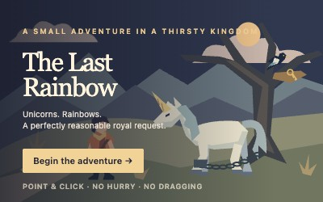

# The Last Rainbow


A short point-and-click adventure about unicorns, rainbows, and a perfectly
reasonable royal request.

Nell, junior weather keeper, is sent to fetch the last unicorn's horn.
The fields are dying, the rain mill has stopped, and the minister has
excellent weather. Something doesn't add up.

Written for the theme **Unicorns and Rainbows**, in the spirit of
*Musa's Quest*, *Swimming With Sharks*, and *Soyuz 404*: polygonal SVG
scenery, small scene functions, inventory puzzles, and dry conversations.
The artwork, characters, and story are new. Like those games, the dialogue
is in English.

## Play

Open **[htdocs/index.html](htdocs/index.html)** directly in a modern browser.
It is a complete, self-contained game; no server or network is required.
Alternatively, run `make serve` and visit
[localhost:8080/htdocs/](http://localhost:8080/htdocs/).

- Click people to talk and objects to inspect or collect them.
- Click an inventory item to use it in the current scene. No dragging.
- Click or press Space to advance dialogue. Choices wait for your answer.
- On touchscreens, slide a finger to inspect; lift it to interact.
- H reveals hotspots. Tab and Enter also work.
- Help offers a contextual hint and a restart option.

Reloading starts a new game. There are no timed puzzles, deaths, or
consumable mistakes. Landscape gives a larger view on a phone; portrait is supported.

## Build

Requires Node.js 20 or later, npm, Python 3, and Make.

```sh
npm ci
make
```

`make` imports the object masters from `svg/atlas.svg`, then builds
`htdocs/index.html` and `archive.zip`. The archive contains
only `index.html`; the build fails above **13,312 bytes**. The delivered
archive is within that limit.

The game itself uses plain JavaScript, DOM events, CSS, and an inline SVG
atlas. There are no runtime dependencies, web fonts, bitmap assets, or
external requests. esbuild minifies the source; Roadroller packs the HTML.
The decoder is generated into the release file and is public domain.
Its temporary decoding memory is capped at 64 MB. Source previews do not
run the decoder.

`bin/packing.json` fixes the compression parameters so identical source
produces identical output. ZIP entry timestamps are fixed, too.

For source development, open `src/index.html` or visit
[localhost:8080/src/](http://localhost:8080/src/) after `make serve`.

## Edit artwork

The editable artwork lives in **[svg/atlas.svg](svg/atlas.svg)**. It contains complete scene backgrounds, whole characters, and independent
objects. Each graphic has one master; repeated objects use references.
Edit inside an object's group, preserve its ID, then run `make`. Changes
appear everywhere that object is used. `make atlas` updates only the readable
source preview. Neither command overwrites your atlas.

Sheet positions and labels are separate from game positions. See
[svg/README.md](svg/README.md) for editing details and scene states.

## Verification

```sh
npm test
```

The Playwright test uses an installed Google Chrome on macOS, or Playwright's
Chromium elsewhere (`npx playwright install chromium`). Set `CHROME_BIN`
to use another Chrome/Chromium executable. It starts and stops its own local
server and uses temporary browser profiles.

Tests play the entire release build through the visible interface in normal
and alternate puzzle order, then repeat on a touch phone viewport. They
check wrong item uses, a deliberately misaligned lantern, fresh starts after reload,
completion, and browser errors. Screenshots go to `tests/output/`.
Set `GAME_SOURCE=1` to test the readable source instead.
Atlas tests also check edit/import round trips, shared references, layout
independence, SVG resources, and missing or duplicate IDs.

## Files

- `svg/atlas.svg` — authoritative, editable object masters.
- `svg/atlas.json` — object IDs and atlas categories.
- `src/index.html` — layout, styles, and generated inline SVG definitions.
- `src/src.js` — scene composition, story, puzzles, and controls.
- `bin/atlas.py` — imports SVG masters into the game.
- `bin/` — deterministic build, packer settings, and ZIP size check.
- `tests/playthrough.mjs` — browser playthroughs.
- `tests/atlas.py` — atlas import tests.
- `WALKTHROUGH.md` — the complete solution, with spoilers.
